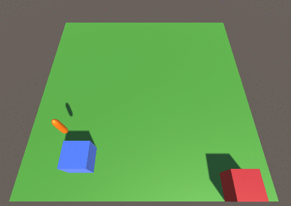

# Construction Unity Environments
Construction environments is a set of reinforcement learning environments with the task of building complex objects from simpler ones. Construction environments is a [Unity](https://unity.com) project inplemented using the [Unity ml-agents tookit](https://github.com/Unity-Technologies/ml-agents). 

## Current environments
### Toy bridge builder
A reinforcement learning agent needs to learn how to build a toy bridge.
Goal: Link the start (blue) and target (red) cubes using the given basic blocks - a support, a square plank, 2 long planks.
Actions: An agent can choose 4 directions where to move and which building block to place.
Observations: Coordinates of blue and red cubes, an array with nearby objects.

Examples of training using Unity ml-agents toolkit built-in PPO algorithm.

After 10 000 steps | After 1.5 million steps | After 3 million steps |
:-:|:-:|:-:
 |  | 
